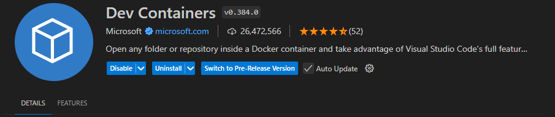

# ORB-SLAM3 Docker Setup

Docker container with **CUDA + X11(GUI) Support + Ubuntu 22.04**

| ORB-SLAM3 Dockerized |
| :---: |
|  |

This guide will walk you through setting up ORB-SLAM3 in a Docker container, running it with a EuRoC dataset, and testing it with different configurations like Monocular, Monocular-Inertial, and Stereo.

> [!note]
> After setup, you can attach to the running container and compile code using the ORB-SLAM3 library. This setup is designed for development purposes and testing different configurations.

> [!important]
> Communication between ORB-SLAM3 is done with sockets in this example. Real world applications usually use ROS communication protocol.

## Prerequisites

- Docker installed
- NVIDIA GPU and drivers with CUDA support for GPU acceleration
- X11 server running for displaying graphical applications

> [!tip]
> For Windows users, you can use `VcXsrv` as your X11 server. Setup instructions are provided in [Step 5](#step-5-setting-up-x11-server-on-windows).

## Getting Started

### Step 1: Running the Docker Container

First, build the Docker image:

```bash
docker build -t orb_slam3:latest .
```

> [!important]
> Run the container with GPU support and X11 forwarding for graphical output:

```bash
docker run -it --gpus all --env="DISPLAY" \
  --env="QT_X11_NO_MITSHM=1" \
  --volume="/tmp/.X11-unix:/tmp/.X11-unix:rw" \
  --name orb_slam3_container \
  orb_slam3:latest
```

### Step 2: Dataset Setup

Inside the container, download and set up the EuRoC MAV dataset:

```bash
cd /opt/orb_slam3

# Create directory for dataset
mkdir -p Datasets/EuRoc
cd Datasets/EuRoc/

# Download the dataset
wget -c http://robotics.ethz.ch/~asl-datasets/ijrr_euroc_mav_dataset/machine_hall/MH_01_easy/MH_01_easy.zip

# Create a directory for MH_01_easy dataset and extract it
mkdir MH01
unzip MH_01_easy.zip -d MH01/
```

### Step 3: Installing Additional Packages

To run graphical applications inside the container:

```bash
apt-get update && apt-get install -y x11-apps
```

Test the X11 setup:

```bash
xclock
```

> [!check]
> You should see a clock window appear on your screen. If it works, your X11 forwarding is configured correctly.

### Step 4: Running ORB-SLAM3 Examples

Navigate to the ORB-SLAM3 directory and run the examples:

#### Stereo Example

```bash
./Examples/Stereo/stereo_euroc ./Vocabulary/ORBvoc.txt \
  ./Examples/Stereo/EuRoC.yaml \
  ../Datasets/EuRoc/MH01 \
  ./Examples/Stereo/EuRoC_TimeStamps/MH01.txt dataset-MH01_stereo
```

> [!tip]
> You can also run other configurations like Monocular and Monocular-Inertial by using the respective executables in the Examples directory.

### Step 5: Setting Up X11 Server on Windows

| Platform | Setup Instructions |
| :---: | :--- |
| **Windows** | 1. Download and install [VcXsrv](https://sourceforge.net/projects/vcxsrv/)<br>2. During configuration, check the box "Disable access control"<br>3. Set `DISPLAY` environment variable in your Docker run command |
| **Linux** | Run these commands:<br>```bash<br>export DISPLAY=host.docker.internal:0<br>xhost +<br>``` |

## Attaching to a Running Container

There are two ways to attach to your running container:

### Method 1: Using Docker CLI

```bash
docker exec -it orb_slam3_container bash
```

### Method 2: Using VS Code

 

1. Install the "Dev - Containers" extension
2. Press `Ctrl + Shift + P`
3. Select "Remote-Containers: Attach to Running Container"
4. Choose the `orb_slam3_container`
5. Select `/opt/` as the workspace folder

> [!tip]
> To change the workspace folder later, press `Ctrl + Shift + P` and select "Remote-Containers: Open Container Configuration File"
